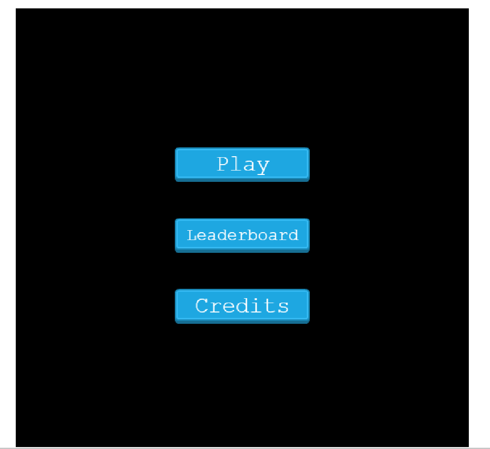
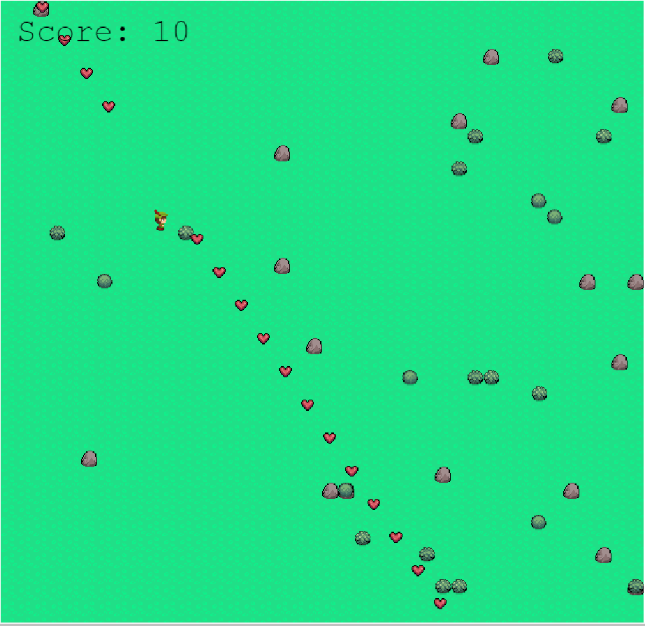

# Game of life

> A luck based game made with Phaser 3.

Use the arrow keys to move the player Up, Down, Left and Right. Collect all the hearts 
in order to complete the game, But thats not all, everytime you collect a heart, you get
transported to some place else. 

## Screenshot


## Live Demo
- [live demo](https://nifty-jang-7465f7.netlify.app)

## Built With
- JavaScript and Phaser 3.
- HTML 5 and CSS 3.


## Getting Started

- Clone the repository using ```git clone git@github.com:iam-Akshat/capstone-game.git```
- cd into the cloned repository with ```cd capstone-game```
- Run ```npm i```
- Run ```npm run watch```
- Open the index.html file in the 'dist' folder.

## Testing
- App uses jest for testing, it should already be installed using `npm i` from getting    started section.
- run `npm test` to start running tests.
## Authors

👤 **Akshat Sethi**

- Github: [iam-Akshat](https://github.com/iam-Akshat)
- Twitter: [Akshat Sethi](https://twitter.com/akshatsethi)
- LinkedIn: [Akshat Sethi](https://linkedin.com/in/akshatsethi)


## 🤝 Contributing

Contributions, issues and feature requests are welcome!

Feel free to check the [issues page](https://github.com/iam-Akshat/capstone-game/issues).

## Show your support

Give a ⭐️ if you like this project!

## Acknowledgments

- [Microverse](https://www.notion.so/RPG-game-f94a617841e240a293c0b6928beebe89)
- Map tiles and collectibles by [PixelPete](https://petermilko.itch.io/)
- Hero sprite by [ansimuz](https://ansimuz.itch.io/tiny-rpg-forest)

## 📝 License

This project is [MIT](https://opensource.org/licenses/MIT) licensed
